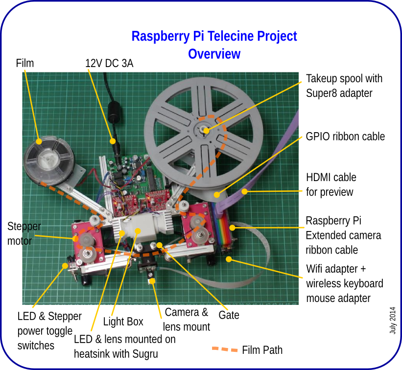

# RPi Telecine Project

This project consists of code and models for an 8mm film scanner project based around a Raspberry Pi model B and camera module.
Most of the code is written in Python.

The project is designed to be able to reliably capture each frame of a reel of 8mm film 
(Super 8 or Standard 8) as a high quality photo. Bracketing is possible to cope with underexposed
or dense film.

Once captured, the folder of image files can be transferred to a PC for further processing.

Futher information is available in this Github repository:

* [Description of the electronics](docs/electronics.md)
* [Construction details](docs/mechanics.md)
* [Typical workflow used to digitise films](docs/workflow.md)
* [Hints for post production on a PC](post-production/README.md)
* [Detailed photos available in the images folder](images/)

## Video

Some test transfers are on Youtube:

* Overview: http://youtu.be/xm3jTsKSOtE
* London to Brighton: http://youtu.be/7-SdT0FMGkM
* Derby Day: http://youtu.be/9bVeMD78gXc
* Blackpool illuminations: http://youtu.be/ZH1QqgxNLk8
* Wings of Speed: http://youtu.be/DhBY11DGUps

## Acknowledgements

Thanks to [Raspberry Pi](http://raspberrypi.org) for a splendid little computer and excellent camera module!

Rpi Telecine project design was somewhat inspired by the [Kinograph project](http://kinograph.cc/)

3d printed Gate was inspired [by this design](http://www.mets-telecinesystem.co.uk/index.php/how-its-made/making-the-film-gate).

Chassis makes use of [Makerbeam and accessories](http://www.makerbeam.eu/)

Code makes use of:

* Dave Hughes' [Python picamera library](https://pypi.python.org/pypi/picamera)
* [OpenCV Python bindings](http://opencv.org/)
* Numpy and Scipy

This is a work in progress, and hasn't yet been used on any precious films. It's a good idea to
test using only 'disposable films'. Ebay is a good source of old 'home movies'. 
