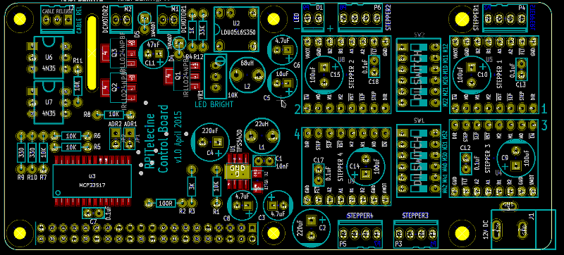
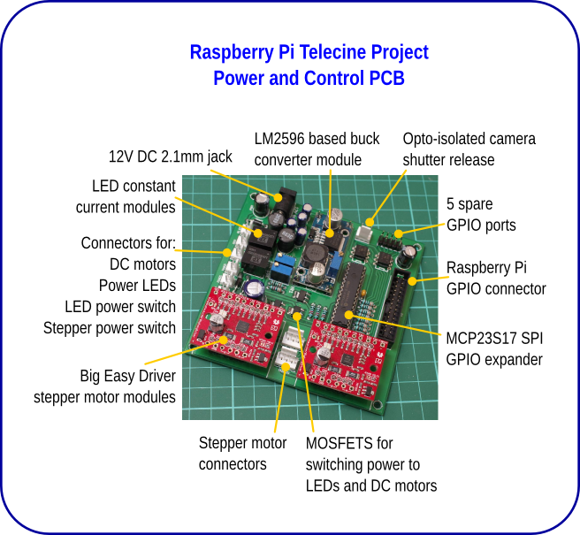
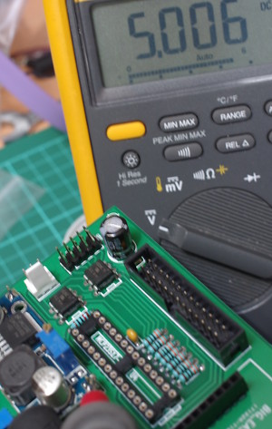

# RPi Telecine Electronics

## The new PCB

The new controller PCB is designed be more compact, is based on the Pi HAT layout
and connects directly to the 40 way expansion header on a V2 Raspberry PI or Model
B+. It extends behind the Pi to allow for the stepper motor drivers.

It is very similar in function to the previous board, but there are a few differences:

* 5V regulator is based on a Texas Instruments TPS5430 switching regulator. More compact than the 5V module on the old PCB
* Up to 4 stepper motor drivers using inexpensive Polulu or Stepstick type A4988 or DRV8825 modules
* DIP switches to set microstepping control pins on driver boards
* SOIC MCP23S17 IO expander. The SMD chip is much smaller than the DIP version, and SOIC isn't too tricky to hand-solder
* Optional jumpers to set address of MCP23S17
* Only one XPPower LED driver module. Decided that a high CRI LED is pretty good, and saves the light mixing problem.

It's also designed to be generic enough to be used as a timelapse or panoramic
mount controller, so I've kept the opto-couplers to allow for triggering an
SLR or other camera, although it's not used for this telecine project.

Aside from the SOIC chips, MOSFETS and a diode in the 5V regulator circuit, all 
components are through-hole. The surface mount items are selected for easy hand-soldering.

## The old PCB

The old PCB is 10cm x 10cm, and is designed to connect to the Pi with a ribbon 
cable. It might be possible to connect it directly to the Pi - but a spacer 
may be required to clear the Pi's ethernet port, and allow space for the camera 
ribbon cable.

The PCB design is pretty simple and comprises the following sections:

* 12V input
* Connectors for 5V regulator for Raspberry Pi and DC motors
* MCP23S17 16 channel IO chip connected to Raspberry Pi SPI port
* 2 x XPPower LED Driver modules + filter and control voltage circuitry
* Headers for 2 x Big Easy Driver stepper motor controllers
* Optically isolated shutter release for external camera
* Mosfet switches for power to 2 x DC motors + LED light
* 5 x GPIO header for unused bits on MCP23S17
* Headers for toggle switches for power to LEDs + Stepper motors
* Headers for 2x power LEDs, 2x DC motors, 2x 4wire stepper motors
* 26way header for Raspberry Pi GPIO port

It is a pretty simple circuit - all through hole components, except for three 
power Mosfets. It uses modules for the 5V power regulator, LED drivers, and 
stepper motors. Power is designed to be provided by a 12V supply, rated at 3A+,
that uses a standard 2.1mm DC jack plug.

5V is provided by an inexpensive LM2596 based module, soldered to headers on 
the PCB. It's also possible to use an alternative buck converter using the pads 
for an alternative header. It's important to use a module that can cope with 2A 
output. I found one of the two LM2596 modules I bought dropped the voltage too 
much when the DC motors were powered, causing the Pi to reboot. Not good. The 
other one works fine. On the prototype I also used a hacked 2A rated car-USB
adapter.

The Raspberry Pi is powered through the 5V line on the 26way connector, so as 
this avoiding the protection on the Pi, it is very important to check the 
voltage provided by the regulator so that it exactly outputs 5V. These modules 
can be set to output anything from 1 - 12V. Adjust the trimmer to the correct 
voltage before connecting the Pi.

**Very Important**

Using a SPI controlled 16 bit IO expander (the MCP23S17) means that everything 
can be controlled simply using the Python bindings for 
[WiringPi](http://pi.gadgetoid.com/article/wiringpi-version-2-with-extra-python).
It also means that the telecine control scripts can be run as a normal user.

LEDs take advantage of XPPower's LDU05/07/14 Series constant current 
drivers. I have tested with their 700mA, 350mA versions. Details and a link to the 
datasheet are available 
[here](http://uk.farnell.com/xp-power/ldu0516s350/led-driver-dc-dc-cc-0-35a-14v/dp/2082733).
[Datasheet PDF](http://www.xppower.com/pdfs/SF_LDU05-14.pdf) The input filter 
using a 68uH inductor is from the datasheet. The inductors are also available 
[from Farnell](http://uk.farnell.com/murata-power-solutions/13r683c/inductor-68uh-10-1-3a-th-radial/dp/2062695)

The LED drivers also allow for brightness adjustment using a voltage control. I 
implemented this using a trimmer potentiometer and voltage divider.

Stepper motor drivers are 
[Big Easy Stepper drivers](http://www.schmalzhaus.com/BigEasyDriver/) available from 
[Pimoroni](http://shop.pimoroni.com/products/sparkfun-big-easy-driver), 
[Hobbytronics](http://www.hobbytronics.co.uk/big-easy-stepper-driver),
[Sparkfun](https://www.sparkfun.com/products/11876) and other places. They're 
really easy to use, and support 1/16th microstepping, which allows for fine tuning 
of the position of the film. The drivers are plugged into header sockets on the
PCB. It's possible to use screw terminals on the BED boards, or use 2.54mm headers
for the motors. As the BigEasyDriver boards are controlled by 3.3V logic, the 3V/5V 
jumper pad has to be bridged with solder.

Mosfets on the board are the only surface mount components - these are in 
SOT-223 format which is pretty easy to solder. IRLL024NPBF.
[From farnell](http://uk.farnell.com/international-rectifier/irll024npbf/mosfet-n-55v-4-4a-sot-223/dp/8651205?Ntt=8651205)
or cheaper [from CPC](http://cpc.farnell.com/jsp/search/productdetail.jsp?SKU=SC11049) 
These switch the power to the DC motors and for the LED modules. These are logic level
MOSFETS, and are rated to 55V and 4.4A, and require only 2.2V to switch on fully.

Camera release is based around a pair of 4N35 optocouplers. With a 2.5mm jack it can
be used for Canon and Pentax DSLRs. Might also be suitable for other cameras. The 
optocouplers isolate the camera circuit from the Pi. This isn't used for my current
project, but means the PCB is versatile, so could be used with an DSLR like the 
original Kinograph system - or allows the PCB to be used as a timelapse controller.

PCB was designed in Kicad, and I created modules and footprints for the 
BigEasyDrivers, LED drivers and DC module. It was made by Smart-Prototyping, as 
they were having  a special offer on 10x10cm boards.

[Kicad project files are here](../hardware/RPI telecine circuit.zip).

[Gerbers for the PCB are here](../hardware/Gerbers.zip).

