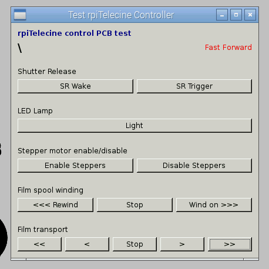

# Telecine GUI software 

The Telecine GUI software is designed for use on a Raspberry Pi version 2, as 
it is designed to take advantage of the multiple cores on the latest version,
and the software really benefits from the additional memory available.

For installation of the software, and the libraries it relies on, 
[see the software setup guide](software-setup.md). 

It is written in Python with the PySide language bindings. My aim is to make
an easy to use GUI that allows a job to be set up with the optimal camera 
settings.

What it doesn't aspire to be is a video editor or transcoder. Processing the
captured images is better done on a more capable PC.

## The main GUI 
```
telecinegui.py
```
The main application manages the setup of the film and capture settings, and
can be used to launch and monitor the telecine job.

*Work in progress*

## Controller test program
```
testController.py
```
This is a simple application used to test the operation of the controller PCB
and connections with the hardware. 



Just click the buttons and the various bits of the hardware should jump into life.
It's useful to check that connections have been made correctly - i.e. that the
motors spin in the correct direction.

The fast wind buttons can be used to rewind film back onto its original spool
after a job has been finished.